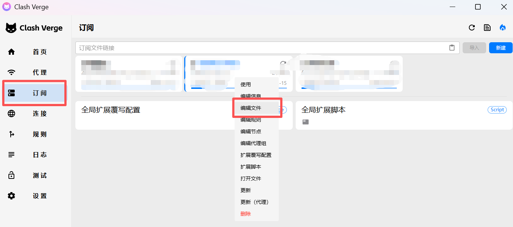

# Mihomo 代理工具使用说明

Mihomo 是一个高性能的代理工具，专为命令行环境设计，支持 Clash 配置格式，让你能够在终端中轻松使用代理服务。

## 安装

```bash
git clone https://github.com/potentialming/mihomo.git
```

## 快速开始

### 1. 准备配置文件

#### 从 Clash 获取现有配置
如果您已经在使用 Clash，可以直接复制现有配置：



1. 打开 Clash 客户端
2. 点击左侧的"订阅"或"配置"选项
3. 找到您要使用的订阅配置
4. 右键点击该订阅
5. 选择"编辑文件"
6. 全选配置内容（Ctrl+A）并复制（Ctrl+C）
7. 将复制的内容粘贴到项目目录下的 `config.yaml` 文件中

### 2. 启动代理服务
```bash
# 进入项目目录
cd /path/to/mihomo

# 给程序添加执行权限
chmod +x ./mihomo-linux-amd64-v1.18.1

# 启动 mihomo（注意-d .后面有个空格）
./mihomo-linux-amd64-v1.18.1 -d . 
```

### 3. 配置系统代理
**重新打开一个新终端**，设置环境变量（端口号需与 config.yaml 中的配置保持一致）：
```bash
export https_proxy=http://127.0.0.1:7890/
export http_proxy=http://127.0.0.1:7890/
```

### 4. 验证代理
```bash
# 测试代理是否生效
curl -I https://www.google.com
```

## 文件说明
- `mihomo-linux-amd64-v1.18.1` - 主程序文件
- `config.yaml` - 配置文件（需要替换为您的配置）
- `Country.mmdb` - GeoIP 数据库
- `GeoSite.dat` - 域名规则数据库

## 注意事项
- 确保端口 7890 未被其他程序占用
- 配置文件格式需要符合 mihomo 规范
- 代理设置仅在当前终端会话有效

## 停止服务
在运行 mihomo 的终端中按 `Ctrl+C` 停止服务。